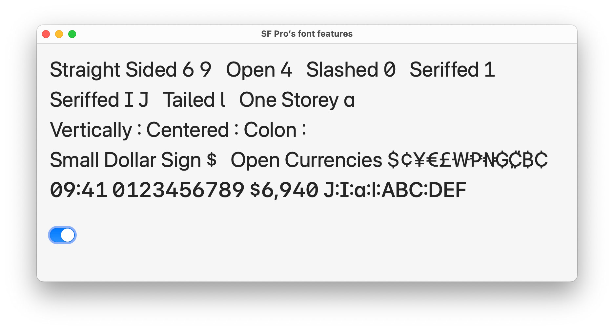

# TypographicFeatures

An extension to configure TrueType and OpenType font features on Apple platforms.

Includes NSFont (macOS AppKit) extension to allow switching of SF Pro font features.

I have not implemented it for UIKit and SwiftUI, but it would be possible to call APIs from other environments via `FontDescriptor` extension.

## More info

- Font feature registry
	- https://developer.apple.com/fonts/TrueType-Reference-Manual/RM09/AppendixF.html

- Layout defines
	- "CoreText/SFNTLayoutTypes.h"

- Syntax for OpenType features in CSS
	- https://helpx.adobe.com/fonts/using/open-type-syntax.html
	- https://helpx.adobe.com/jp/fonts/using/open-type-syntax.html (JP)

- Character variants / Stylistic set
	- https://learn.microsoft.com/en-us/typography/opentype/spec/features_ae#tag-cv01--cv99
	- https://learn.microsoft.com/en-us/typography/opentype/spec/features_pt#ssxx

## License

See [LICENSE](./LICENSE) for details.
